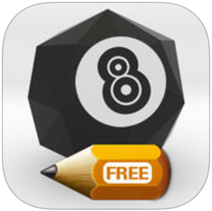

# Development Profile

As an application developer, I have over a decade of experience with many different clients/companies with varying projects using many different technologies. I've taken projects from concept to development to deployment; from the backend to the frontend. Here are some current highlights of my open sourced work.

## Journ

> Journ is a Node package program based on my style of journaling, where I like to store notes in markdown format. With each day in its own file and stored as text files, I could easy search and view them from my command line and easily back them up to GitHub for archiving. With Journ, I rebuilt the bash scripts I used to organize my files to a Javascript Node package to share in open source.

* https://www.npmjs.com/package/journ
* Stores each day as its own .md file
* Has tools to combine days into weeks for reports and export to pdf

## Gongfu
> A template for a RESTful API project, where the front end and back end are built with Grunt in a virtual dev environment. The example application is a simplified Twitter clone.

Video of Golang techtalk

* https://github.com/kyledinh/gongfu
* Vagrant/VirtualBox for building dev environment
* Grunt/Node for project builds
* Golang backend to build a RESTful API
* Angular as frontend
* Less for CSS processing and Bootstrap from source
* Postgres database

## 8Ball Scorer (IOS App)

> This is a handy mobile app to score keep for billiard league matches. Handles various details for handicapped matches.

* https://itunes.apple.com/us/app/8ball-scorer-free/id989644353?mt=8
* Written in Native IOS/Swift
* Data is importable/exportable in JSON format

## Other Open Source Projects

* https://www.npmjs.com/package/npm-minesweep
* https://github.com/kyledinh/verkbox
* https://github.com/kyledinh/maalbox

## Clients & Projects

* https://www.rallyhealth.com/
* https://www.getscreenednow.org/
* https://pastabiz.com/
* http://www.volanobiz.com/
* https://www.redbridgenet.com/
